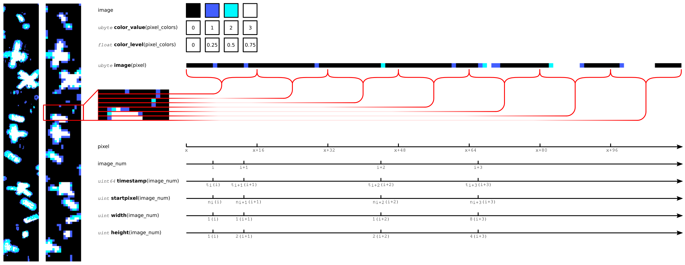

.. title:: SPIF Main

************************************
SPIF – Single Particle Image Format
************************************

..
	For full information on the SPIF data standard and usage examples see [paper_placeholder](https://github.com/graemenott/spif-paper).

.. _motivation:

Background and Motivation
=========================

The SPIF data standard was conceived as an open and accessible means of storing individual cloud particle images. Real-time images of liquid and ice particles from aircraft are routinely generated by optical array probes (OAPs) [#Knollenberg1970]_. OAPs use a one-dimensional photodiode array to record successive slices of an image of the shadow that is cast by a particle as it moves across the instrument's sample volume. The use of such instruments has led to decades worth of in situ cloud particle-by-particle data taken across the gamut of pristine and anthropogenically-modified [#Quaas2015]_ cloud types. More recently, probes using two dimensional imagers, such as the `SPEC <http://www.specinc.com>`_ CPI (Cloud Particle Imager) [#Lawson2001]_ and HOLODEC (Holographic Detector for Clouds) [#Fugal2009]_ have been used to produce very high resolution images with greater colour depth of cloud particles.

Image data from such probes is recorded in proprietary and instrument- or system-specific formats. Binary formats have evolved due to the limitations of legacy hardware and limited system bandwidths. This means that is a significant barrier to new users of image data, particularly for users that are not from fields that have traditionally used such cloud data. Fields such as remote sensing and atmospheric process modelling may well benefit by being able to ingest raw cloud particle data into their processing streams as these applications may require specialised or different processing options to those normally used by those in the cloud measurement community.

The SPIF standard has been designed so that decoded raw binary data are stored in a `netCDF4 <https://doi.org/10.5065/D6H70CW6>`_ file structure with a standardised vocabulary in accordance with `FAIR Guiding Principles <https://www.go-fair.org/fair-principles/>`_ [#Wilkinson2016]_. It is hoped that this will improve access to this data for users from a wide range of fields and facilitate the sharing, refinement, and standardisation of data processing routines (for a discussion on inconsistencies between current particle processing routines see McFarquhar et al., 2017 [#McFarquhar2017]_
).

SPIF Files
==========

The SPIF Standard
-----------------

The SPIF standard is a standardised vocabulary for storing image data and metadata in `netCDF4 <https://doi.org/10.5065/D6H70CW6>`_ files. NetCDF allows for fully self-describing, archival standard data and is supported on a variety of platforms, environments, and programming languages and commonly used in earth science communities. Conventions and best practice guides such as `Attribute Convention for Dataset Discovery <https://wiki.esipfed.org/Attribute_Convention_for_Data_Discovery_1-3>`_ (ACDD) and `CF (Climate and Forecast) Conventions <https://cfconventions.org>`_ are used to standardise the netCDF4 metadata and variable structures to suit a particular field and so facilitate access, standard workflows, and comparison between datasets.

In a similar fashion to the CF Conventions; SPIF defines a minimum vocabulary, that is groups, variables, and attributes, that must be included for compliance. SPIF is referred to here as a format standard, rather than a convention, as it stipulates the form of the variable data as well as variable attributes. This is to ensure that all raw data required for processing is included in a consistent structure. SPIF has been designed to be compatible with common data conventions so is possible to create a SPIF file that is also compliant with ACDD, CF, other conventions, and any organisational requirements.

Additional data can be stored in a SPIF file along with the required vocabulary to provide ancillary data from other sources, processed data products, or instrument housekeeping data to aid in diagnostic investigations. Any such data contained within the file is optional but should not conflict with requirements of the SPIF standard.

Standard Compliance
-------------------

This `repository <https://github.com/FAAM-146/spif>`_ contains the *vocal* project for the SPIF data standard. *Vocal* is a tool for managing netCDF data product standards and associated data product specifications. It can be used to check netCDF file compliance to a standard, including SPIF. See the `SPIF project README <https://github.com/FAAM-146/spif>`_ for more details.

The SPIF convention string can be added to the ``Conventions`` global attribute of a netCDF file that is compliant, that is;

.. code-block:: ncl

	Conventions: "SPIF-m.n"

where ``m`` is the major version, and ``n`` the minor version of the SPIF standard.

SPIF File Structure
-------------------

SPIF files use netCDF4 groups to divide multiple imaging instruments and to separate image data from other types of data. The group structure of a SPIF file will look like;

.. parsed-literal::
	:name: spif-structure-basic

	**root**
	│
	├── *platform*
	│
	├── **<imager-1>**
	│   │
	│   ├── **core**
	│   │
	│   ├── *auxiliary*
	│   │
	│   ├── *level-0*
	│   │
	│   ├── *level-1*
	│   │
	│   └── *level-2*
	│
	├── <*imager-2*>
	│   │
	│   └── ...
	│
	└── ...

Groups in bold are mandatory while those in italics are optional. The imaging instrument groups are labelled as ``<imager-1>``, ``<imager-2>``\ ...\ ``<imager-n>`` where the angled braces ``< >`` indicate that the name actually used in the SPIF file will be some other string. Documentation uses ``imager`` to distinguish these groups from those containing non-imaging instrument data. The file structure and required vocabulary are described below.

The SPIF definition is constrained to ensure that standard-compliant files contain all the information/data required for reconstruction of the raw image data. SPIF files must contain, as a minimum, a mandatory vocabulary. That is; groups, attributes, and (coordinate) variables. These are discussed in the sections below.

.. seealso::
	Details of the mandatory vocabulary of a netCDF file are described in;

	.. include:: dynamic_content/substitutions.rst
		:start-after: ReqVocabFileStart
		:end-before: ReqVocabFileStop

File root
^^^^^^^^^

There are only two required global attributes. This first of these is ``Conventions``. This must include the text ``SPIF-m.n``, where ``m.n`` are the major and minor versions. Other recognised conventions strings can also be included in a space- (recommended) or comma-separated list.

The second required global attribute is ``imager_groups``. This is used to identify groups of imaging data that conforms to the SPIF structure. It is possible to have multiple groups within the file root and these may or may not contain image data. This attribute makes it easy for users to find those groups. If there are more than one imager group then these should be given as a space- (recommended) or comma-separated list.

..
	Should ``imager_groups`` be mandatory or just recommended (when there are more than one imager group)?

.. include:: dynamic_content/substitutions.rst
	:start-after: root_ReqAttrsStart
	:end-before: root_ReqAttrsStop

It is assumed that most users will add additional root attributes to make the file more useful and easy to use. There are many recommended global attributes, refer to the `ACDD <https://wiki.esipfed.org/Attribute_Convention_for_Data_Discovery_1-3>`_ which lists some commonly used attributes.

Imager group
^^^^^^^^^^^^

The image data from an appropriate instrument is contained within a special group in the SPIF file ``root``. It may make sense to include more than one imager group for multiple instruments or an instrument with more than one channel, for example the `SPEC <http://www.specinc.com>`_ `2D-S (Stereo) Probe <http://www.specinc.com/2d-s-stereo-probe-operation>`_ which has two orthogonal OAPs, in the same file. The names of the imager groups are not prescribed but should be descriptive, for example for the 2D-S the imager group names may be ``2DS_horizonal`` and 2DS_vertical``. In this text the imager groups are written as ``<imager-1>``, ``<imager-2>``, etc where the braces indicate that it is not a literal string.

There are two mandatory imager group attributes;

.. include:: dynamic_content/substitutions.rst
	:start-after: imager_ReqAttrsStart
	:end-before: imager_ReqAttrsStop

The mandatory group attribute ``instrument_name`` and the recommended group attribute ``instrument_long_name`` should contain more complete instrument information. As with the root attributes, users may wish to greatly increase the number of imager group attributes to fully describe the instrument and how it was used. The ``group_type`` attribute must contain contain the string "imager" as an identifier for compliance checking.

..
	It is recommended (?) that ``group_type`` be removed from the SPIF mandatory list. It only required by *vocal* and if this is not used then it seems superfluous.

The imager group contains variables with information about the probe size, resolution, and other data required for interpreting the raw images.

Imager core group
^^^^^^^^^^^^^^^^^

The imager ``core`` group is a sub-group of the ``imager`` group and contains the flattened image data. All image data has been extracted from the raw binary file and stored in a more :ref:`usable form <Image Data>` in the ``<imager>/core/image`` variable.

The length of the 1-dimensional image array is the product of the number of images, given by the unlimited dimension ``image_num``, the width and height of each image, and the number of ``array_dimensions``. Depending on the type of instrument, the width and/or height may be fixed or variable for each image. The maximum value of the coordinate variable ``image_num`` is the number of images in the dataset while the maximum value of ``pixel`` is the total number of pixels in the image array.

The arrival time of each image is given by ``timestamp`` in a recognised time, usually nanoseconds, from a reference time. ``timestamp`` has a ``units`` attribute string that conforms to the `UDUNITS recommendation <https://cfconventions.org/Data/cf-conventions/cf-conventions-1.11/cf-conventions.html#time-coordinate>`_, for example "nanoseconds since 2024-01-01 00:00:00 +0". The ``timestamp`` variable has
a ``standard_name`` attribute "time". It's worth mentioning that due to the random nature of cloud sampling, the data in ``timestamp`` will be highly irregular and different from what one may expect from 'usual' time series data.

Note that different probes may not provide image times in exactly the same way and indeed, image arrival time may in some circumstances be difficult to precisely define. However, the ``timestamp`` variable will always give the image arrival time as accurately as possible, a description of how it was determined from the raw buffer data should be included in the ``comment`` or another variable attribute. One may decide to add a ``timestamp_flag`` as an ancillary variable using the `CF flag <https://cfconventions.org/Data/cf-conventions/cf-conventions-1.11/cf-conventions.html#flags>`_ format to quantify the reliability of each time stamp.

Mandatory ``imager/core`` group attributes are;

.. include:: dynamic_content/substitutions.rst
		:start-after: core_ReqAttrsStart
		:end-before: core_ReqAttrsStop

The ``group_type`` attribute must contain contain the string "core" as an identifier for compliance checking.

..
	It is recommended (?) that ``group_type`` be removed from the SPIF mandatory list. It only required by *vocal* and if this is not used then it seems superfluous.

.. _Image Data:

Image Data
----------

Image data has been extracted from the raw binary file with no processing or filtering applied during the extraction process. This is to maintain a accurate copy of the original raw data. Potentially corrupt images, repeated images, and noise are all included. Each image may also contain multiple particles, there has been no processing to split out the multiple particles from a single image. Particle images may be produced with a one dimensional photodiode array or a two dimensional sensor and may be monoscale, greyscale of few or many tonal levels, or possibly colour. To cope with the differing image dimensionalities, images are all flattened to a one dimensional numerical array. Flattened data from each image is appended to the array in order of arrival. For an OAP with a one dimensional photodiode array this means that the images are read across the array, or perpendicular to the air/particle flow direction. A nanosecond resolution timestamp corresponding to the first pixel of an image is given to provide arrival times.

An image illustrating the flattening of a four level greyscale OAP image for storage in the ``<imager>/core`` group is shown :ref:`below <OAP_image_flattening>`;

A real 64 diode array image on the far left has been downsampled to a theoretical 16 diode array purely for the purposes of clarity in this illustration. Each row or slice of the image is concatenated in turn onto the end of the image array with other variables in the ``<imager>/core`` group indicating the time and dimensions of each new image.

SPIF Extensions
---------------

The primary purpose of the SPIF standard is consistent storage of raw data, it may be convenient to include supplemental data and/or processed data in the same file. Although additional non-conflicting variables can be added to the <instrument> and <instrument>/core groups additional groups can be added to keep appropriate data variables together. Some recommended groups are given here.

Extended example is;

In addition to these mandatory netCDF parameters, a SPIF file can be extended with additional groups, attributes, and (coordinate) variables.

.. seealso::
	Recommended optional vocabulary is described as part of;

	.. include:: dynamic_content/substitutions.rst
		:start-after: OptVocabFileStart
		:end-before: OptVocabFileStop

Using SPIF for other Types of Image Data
========================================

Although the SPIF standard was designed to address issues in a specific :ref:`application <motivation>`, its use is not limited to atmospheric particle data. Although metadata can be embedded within image files using formats such as `Exif <https://en.wikipedia.org/wiki/Exif>`_ or `XMP <https://en.wikipedia.org/wiki/Extensible_Metadata_Platform>`_, this can become unwieldy as the complexity of the metadata increases. As the netCDF4 structure is very flexible and the SPIF format tolerant of expanded vocabularies, arbitrary metadata and ancillary data can be included within a SPIF-compliant file alongside the image data. While particle image data is stored with a temporal resolution of nanoseconds, any convenient timestep recognised by the `CF Conventions <https://cfconventions.org>`_ is supported.

In terms of the image data; multispectral or time-synchronised stereoscopic images for example could be included in a single ``<imager-1>/core/image`` variable by increasing the number of image dimensions before flattening. Unsynchronised but timestamped images can be stored in two separate <imager> groups within the same file along with shared ancillary data.

An imaginary example may be storing data from a visible camera and a second that records laser-induced fluorescence images of an object undergoing a chemical reaction. Reagent parameters and laser pulse triggers and energies could be recorded in ancillary groups. One may construct a file structure as below that conforms to the :ref:`SPIF standard <spif-structure-basic>` structure.

.. parsed-literal::
	:name: spif-structure-imaginary

	**root**
	│
	├── **visible**
	│   │
	│   └── **core**
	│
	├── **fluorescence**
	│   │
	│   ├── **core**
	│   │
	│   └── laser_power
	│
	└── reagents

.. rubric:: References

.. [#Knollenberg1970] Knollenberg, R. G. The optical array: An alternative to scattering or extinction for airborne particle size determination. J. Appl. Meteorol. 9, 86–103 (1970). https://doi.org/10.1175/1520-0450(1970)009<0086:TOAAAT>2.0.CO;2>

.. [#Quaas2015] Quaas, J. Approaches to Observe Anthropogenic Aerosol-Cloud Interactions. Curr. Clim. Change Rep. 1, 297–304 (2015). https://doi.org/10.1007/s40641-015-0028-0

.. [#Lawson2001] Lawson, R. P. et al. An overview of microphysical properties of Arctic clouds observed in May and July 1998 during FIRE ACE. J. Geophys. Res., 106, 14989–5014 (2001). https://doi.org/10.1029/2000JD900789

.. [#Fugal2009] Fugal, J. P. and Shaw, R. A. Cloud particle size distributions measured with an airborne digital in-line holographic instrument, Atmos. Meas. Tech., 2, 259–271 (2009). https://doi.org/10.5194/amt-2-259-2009

.. [#Wilkinson2016] Wilkinson, M. et al. The FAIR Guiding Principles for scientific data management and stewardship. Sci Data 3, 160018 (2016). https://doi.org/10.1038/sdata.2016.18

.. [#McFarquhar2017] McFarquhar, G. M. et al. Processing of Ice Cloud In Situ Data Collected by Bulk Water, Scattering, and Imaging Probes: Fundamentals, Uncertainties, and Efforts toward Consistency. Meteor. Monogr., 58, 11.1–11.33 (2017). https://doi.org/10.1175/AMSMONOGRAPHS-D-16-0007.1

